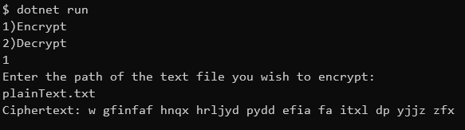

# PolyalphaCipher
PolyalphaCipher is a command line application that either decrypts or encrypts a given text file depending on what the user chooses.

## Requirements to run

You must have .NET downloaded and installed.

From the location of the program in the command line, run the following line
```bash
dotnet run 
```

## Example




